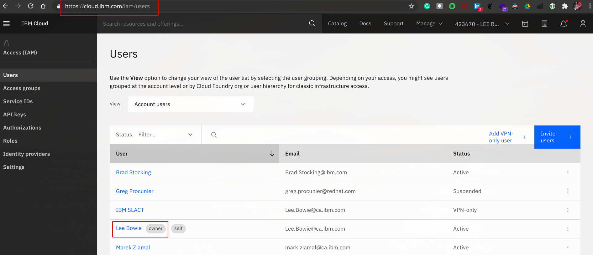
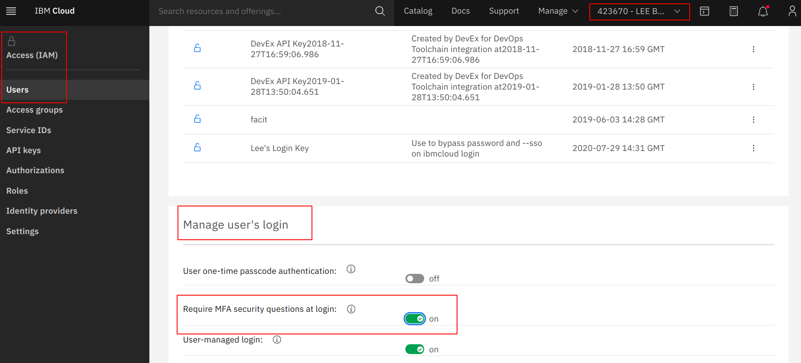

## Protect root / global admins account(s) with Multi-Factor Authentication

### Enforce uniform MFA to company-owned resources
All access authorizations go through the root account and users are restricted to role permissions. These accounts are recorded in IBM Cloud IAM section. Account privileges are audited every 30 days. 

Configure appropriate alerts on root/master accounts to detect a potential compromise, in accordance with the GC Event Logging Guidance 

In the event of a potential compromise the account owner is notified by email. 

### **Validation**
Confirm policy for MFA is enabled through screenshots and compliance reports. 

Video with instructions on how to set up MFA: https://ibm.biz/mark-mfa

Break-Glass Procedure:
IBM Cloud script to stop/shutdown all running compute & VMs in a child-account.
