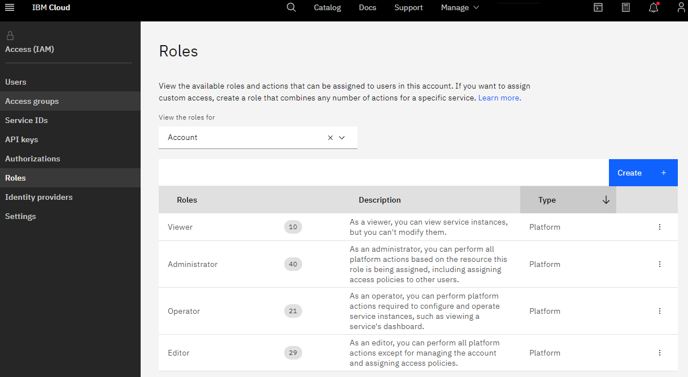

 ## 04 - Enterprise Monitoring Accounts

### Create role-based account to enable enterprise monitoring and visibility

IBM Cloud enables user accounts that are strickly used for monitoring and auditing.

Instructions for the account-owner:
1) Create a new user account with a name in-accordance with CCCS/SSC guidelines.
2) Assign the "Viewer" or "Administrator" role to this account.

The Monitoring account is now created and can be used by SSC or CCCS.
