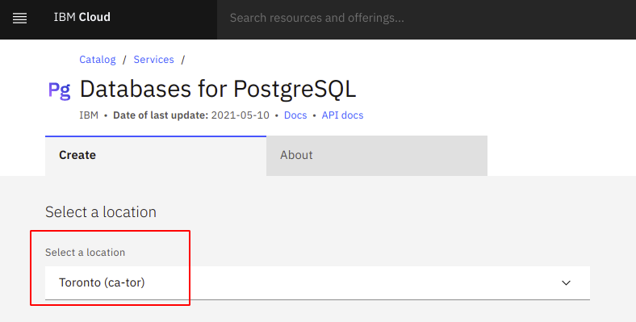
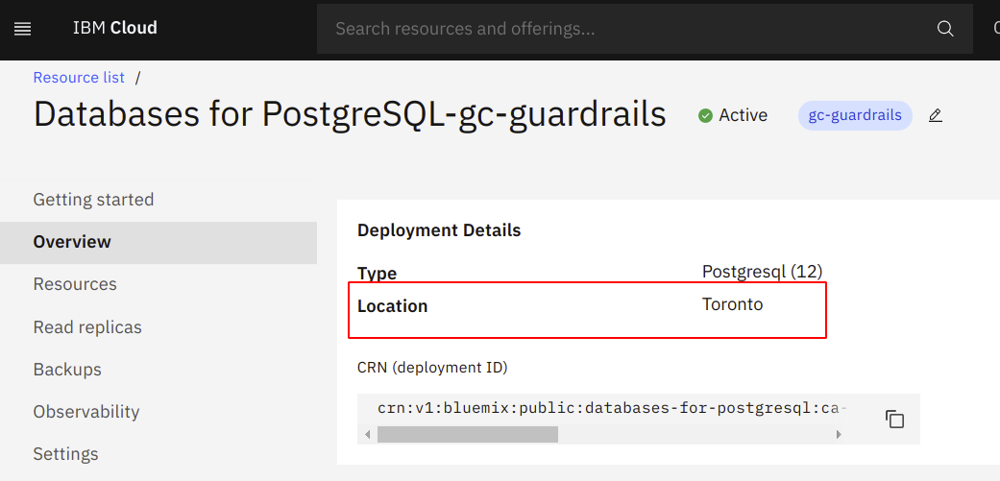

## Data Location 

### Establish policies to restrict GC sensitive workloads to approved geographic locations

root users can define a specific restricted geography that users can create resourses in.

    
### Restricting Resource on the entire Organization
IBM Cloud allows or the creation of resource groups to restrict services within a geopgrahy.  [Managing resource groups]("https://cloud.ibm.com/docs/account?topic=account-rgs")
    

### **Validation**

Example of a service created and restricted to a specific location

GUARDRAIL Steps:
1) Launch IBM Cloud Shell
2) Paste the script-code to run it against you tenant
3) Script will capture & audit all the resources and isolate where they're provisioned from.
4) The results file will contain a 3-column flat-file listing all resources including test results (MON01 & TOR01/02/03 pass, all others fail):

Resource ID | Location | Pass/fail
------------|----------|----------
...|...|...
...|...|...
...|...|...

Expected Results: All rows and summary should say PASS in order to meet the CCCS requirements.
