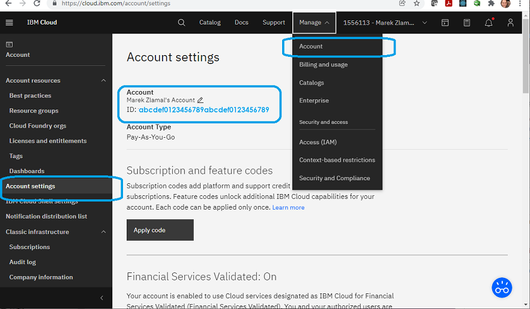
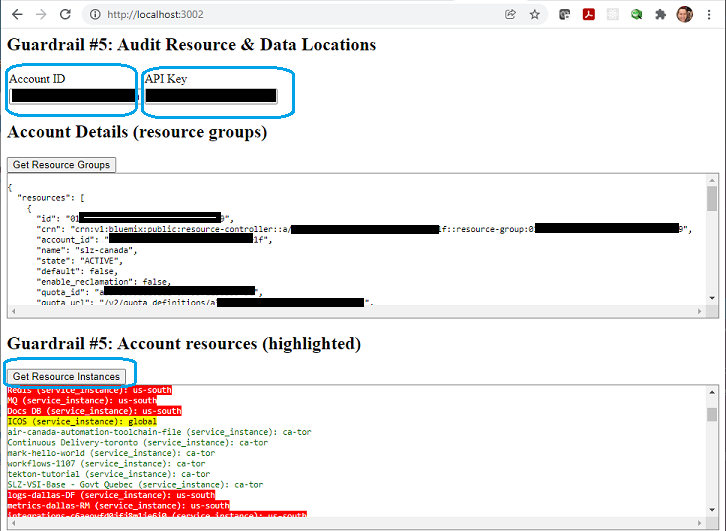

## Data Location 

This guardrail provides methodologies for ensuring cloud workloads operate in designated locations.  Purpose is to ensure that data and resource sovereignty (data locations) is managed by the users of the cloud account.

### Topics
- Approaces to location policies
- Validation: Audit Script that generates results

### Approaces to location policies

- Restricting Resource on the entire Organization
IBM Cloud allows or the creation of resource groups to restrict services within a geopgrahy.  [Managing resource groups]("https://cloud.ibm.com/docs/account?topic=account-rgs")
- It is not best practice to restrict users because it will discourage users from exploring capabilities that are not *currently* available in your region.
- Best practice is education users in the provisioning process to select the appropriate location (see screen-shot below as an exaple for the PostgreSQL service)

### **Validation**: Audit Script that generates results

This script is based on NodeJS and can be run from the cloud shell. Best practice is to run it locally to ensure continuous compliance during development.

GUARDRAIL Steps:
1) Browse to this NodeJS script folder and open a command prompt
2) Launch the command "Node ." - it will automatically execute the index.js file
3) Open a browser and navigate to **http://localhost:3002**
3) Enter an **APIKey** and the respective Cloud account **ID** to audit against. 
4) The script will generate a *color-coded* output indicating all the services and highlighted by compliance. Screen shot below

- Green: Resources are within Canada
- Yellow: Resources are globaly available
- Red: Resources are explicitly outside of Canada

This tool is ideal for continuous compliance usage by development teams.
