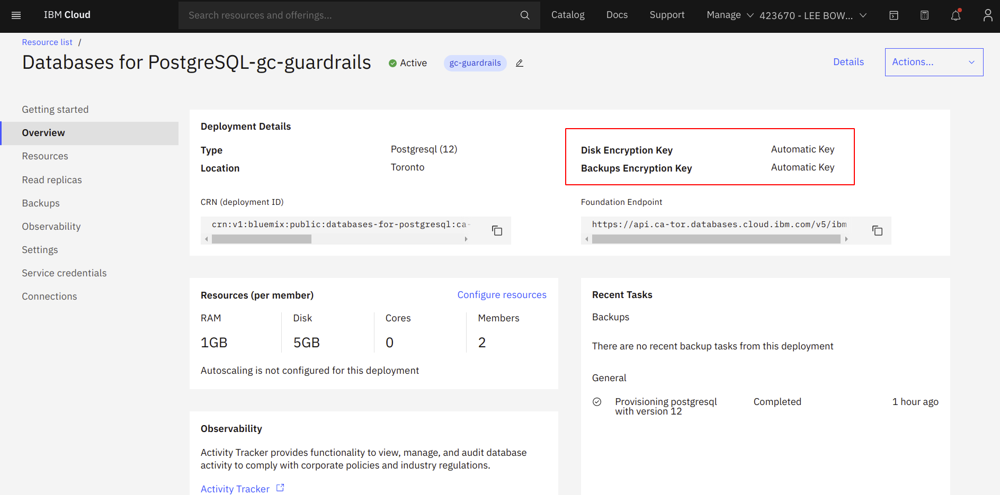
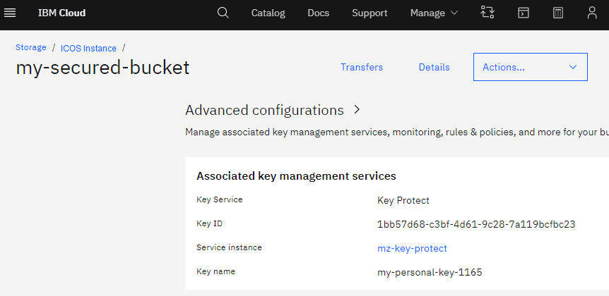

# Encryption at rest in IBM Cloud

### **Encryption of data at rest**
IBM Cloud **encrypts all customer data at rest without any action required from you**, the customer. IBM Cloud encrypts all customer data at rest without any action required from you, the customer.   IBM uses a common cryptographic library to implement encryption consistently across all IBM Cloud products.  This includes data stored in cloud storage, computer engine persistent disks, cloud databases.

### **Layers of Encryptions**
IBM uses several layers of encryption to protect data. Using multiple layers of encryption adds redundant data protection and allows us to select the optimal approach based on application requirements.

All data stored in IBM Cloud is encrypted with a unique data encryption key (DEK).  

**Encryption at rest options include:**
- Encryption by default
- Customer-managed encryption keys (CMEK) using Cloud KMS
- Customer-supplied encryption keys (CSEK)

**An example of encyption at rest validation**

Cloud Object Storage and Data-at-Rest

With cloud object storage, a bucket can be secured via Key Protect and you may apply & keep your own keys.

This is a sample screen-shot of an existing bucket that may be suitable for review & approval by CCCS.
