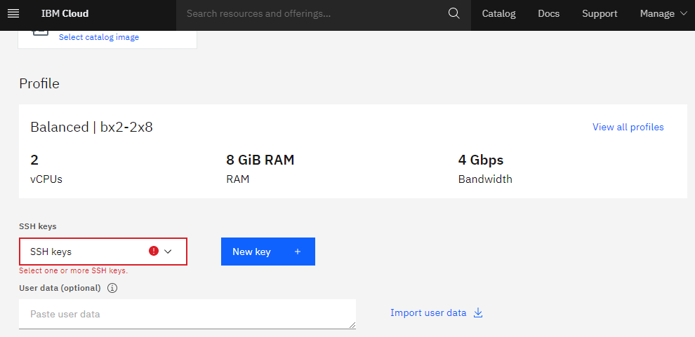

# Encryption in Transit in IBM Cloud

IBM Cloud uses a FIPS 140-2 validated module in our production environment. This means that data in transit to the customer and between data centers as well as data at rest is encrypted using FIPS 140-2 validated cryptography. All regions and zones currently support FIPS 140-2 mode.

## **Encryption in Transit by Default**
IBM encrypts and authenticates all data in transit at one or more network layers when data moves outside the physical boundaries controlled by IBM.  IBM uses various methods of encryption, both default and user configurable, for data in transit.  The type of encryption used depends on the OSI layer, the type of service and the physical component of the infrastructure.  

All Virtual server instances require an SSH key for any level of connectivity.

There are no public endpoints available to access the server resources.
