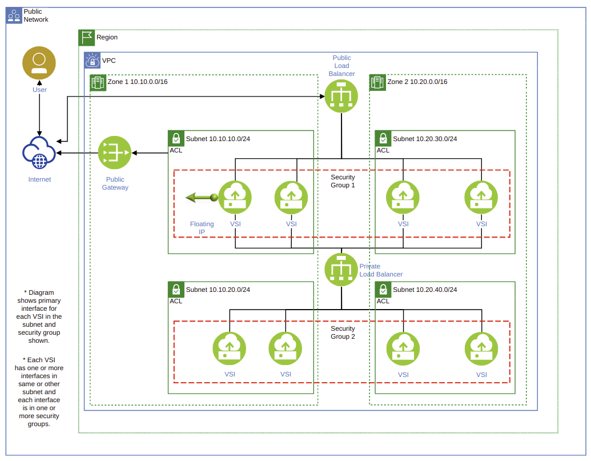

## 08 - Segment and Separate

### Segment and separate information based on sensitivity of information

IBM Cloud encourages network segmentation and seperation in various deplyment models.

**An example of segmented network zones in IBM Cloud**

GUARDRAIL Steps:
1) Run the script that lists all the resources and the VLAN/Subnet they are a part of.
2) The evidence/proof: the listing should align with the architectural diagram (eg: you example architecture). See example below.

Output:

VLAN/Subnet | Resource
------------|---------
224.221.1.1 | ServerA
224.221.1.1 | ServerB
224.226.19.41 | ServerC
224.226.19.41 | ServerD

Expectations: Architecture diagram should reflect that ServerA & ServerB are related to each other (and are visible to each other), but are not visible to ServerC & ServerD (which are on another Subnet).  
